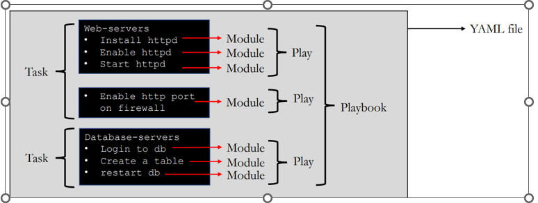

# Ansible & Exam Format:

It is a tool for linux server automation and written in python language.

It is a four-hour exam. we should get 210 out of 300 marks. Exam code ex294. All exam questions should be hands on format.

# What is Ansible & Background:

We can do Conf mgmt, app deployment and enabling infra as a code and written in python language.

We can schedule monthly backups and System Auto Reboot.

2012 project and it is open source developed by Micheel Dehaan and it has been occupied by Redhat in 2015.
 

# Benefits of ansible:

It is agentless and open source, Lot of predefines modules and great product for orchestration. 1300 modules for use.

Websites: ansible.com, docs.ansible.com, galaxy.ansible.com and github.com.


# Basic terms of ansible: 

1. Control node: Servers which runs ansible application. 
2. Modules: Command to be executed in client-side node.
3. Play Book: Automation file with Step-by-step execution of multiple tasks.
4. YAML:  yet another markup language.
5. Inventory: File information about remote clients.
6. Tag: It is a reference or alias to a specific task.
7. Variable: We can repetitively and contains defined value.
8. Role: Splitting playbook into smaller groups, we can reuse it in future.


# Ansible Working Method:

Each task written in a module and multiple modules for a related task called a play. All plays together make a playbook. Finally, playbook written in a YAML file.



To run module through playbook: ansible-playbook example.yml

To run a module independently: ansible myservers -m ping

Conf files: /etc/ansible/ansible.cfg & /etc/ansible/hosts & /etc/ansible/roles

Note: Require python3 and ansible engine cannot installed in windows. We can setup anywhere cloud and On premise also.

# Installation Steps:

This is for installting ansible application in a server, Which the the primary server to push codes and execute all jobs in client machines.

https://docs.ansible.com/ansible/latest/installation_guide/intro_installation.html

```
yum install epel-release
yum install python –y (should be installed already)
yum install ansible ansible-doc
```

(Or)

```
yum/dnf install python3
yum/dnf install python3-pip
pip3 install ansible ansible-doc
```

For Red hat 8 We need to enable ansible engine repository and then install.

Client machine: Just need to install some clients machines to perform actions.


