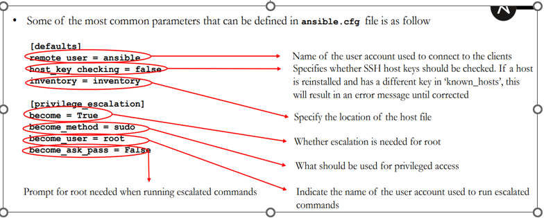
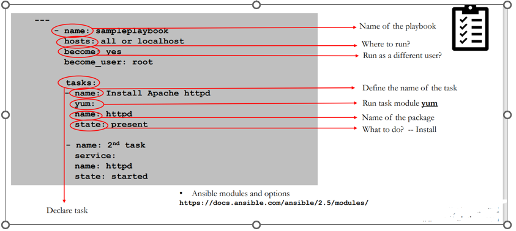

# Ansible Configuration File:

Ansible configuration files come with 5 to 6 elements and we can easy to use it. Screenshot mentioned below.

# YAML File and Syntax:

1. All tasks are executed in sequential order. 
2. Each task is processed one time.
3. Indentation is extremely important.
4. No <tabs> in yaml file. Only use spaces and empty lines have no value
5. File extension is usually yml or .yaml and No difference in double quotes or NO quotes for a task name.
6. YAML Playbook files can be placed anywhere on the filesystem as long as they are being executed with absolute path
7. When a flat file is written in YAML format to execute tasks/plays then it is called playbook j)There is NO need to modify the file permission. rwx—x—x

